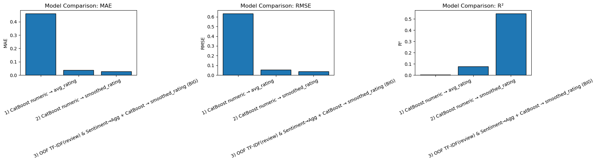

# Final Model

## New Features Added
- `calories_per_ingredient`
- `n_ratings`
- Aggregated review-model features: `rev_pred_mean`, `rev_pred_std`, `rev_pred_min`, `rev_pred_max`, `rev_count`
- Aggregated sentiment/text features: `sent_mean`, `sent_std`, `sent_pos_mean`, `sent_neg_mean`, `review_length_mean`

## Model Used
Our final model was a **CatBoostRegressor** predicting `smoothed_rating` rather than raw `avg_rating`. We used `smoothed_rating` because recipes with only a small number of ratings can have unstable averages, so smoothing makes the target more reliable by shrinking recipes with few ratings toward the overall mean.

The final model used **21 total features**, all of which were quantitative, with **0 ordinal** and **0 nominal** features. These included recipe and nutrition features (`minutes`, `n_steps`, `n_ingredients`, `calories`, `sugar`, `protein`, `carbohydrates`, `total_fat`, `sodium`), engineered features (`calories_per_ingredient`, `n_ratings`), aggregated review-model features (`rev_pred_mean`, `rev_pred_std`, `rev_pred_min`, `rev_pred_max`, `rev_count`), and aggregated sentiment/text features (`sent_mean`, `sent_std`, `sent_pos_mean`, `sent_neg_mean`, `review_length_mean`). Since the final feature set was entirely numeric, we did not need any categorical encoding, and missing values were handled with median imputation.

## Hyperparameters
### CatBoostRegressor
- `iterations`: 4000
- `learning_rate`: 0.03
- `depth`: 6
- `loss_function`: `"RMSE"`
- `random_seed`: 42
- `use_best_model`: `True`

### TF-IDF + Ridge intermediate text model
- `max_features`: 80000
- `ngram_range`: `(1, 2)`
- `min_df`: 2
- `alpha` (Ridge): 50.0

## Tuning Method
To bring in information from the text reviews, we used TF-IDF in an intermediate step rather than directly in the final CatBoost model. We first transformed review text into TF-IDF features using unigrams and bigrams, then trained a Ridge regression model to predict review ratings from the text. After that, we aggregated those predicted review scores to the recipe level, which gave us features such as the mean, standard deviation, minimum, and maximum predicted review score for each recipe. We also included aggregated sentiment and review-length features.

We selected the final CatBoost model by comparing it with the baseline and other candidate models on held-out validation performance. The final version was chosen using a validation set with `use_best_model=True`.

## Performance
- `MAE`: 0.0267
- `RMSE`: 0.0380
- `R^2`: 0.5496

## Improvement Over Baseline
The baseline Linear Regression had `MAE = 0.4652`, `RMSE = 0.6410`, and `R^2 = 0.00016`, while the final CatBoost model achieved `MAE = 0.0267`, `RMSE = 0.0380`, and `R^2 = 0.5496`. This is a large improvement over the baseline. The final model makes much smaller errors and explains a much larger share of the variation in ratings, while the baseline explains almost none.

We believe this final model is good, especially compared to the baseline, because it clearly captures useful information from both the structured recipe features and the review-based features. At the same time, it is not perfect, since an `R^2` of about 0.55 still means there is some variation in ratings that the model cannot explain. That makes sense because user ratings are subjective and noisy.

## Why These Features Make Sense
These features make sense for the prediction task because ratings are not only influenced by the recipe itself, but also by how people describe their experience with it. For example, more positive reviews, more consistent review scores, and stronger sentiment patterns should all relate to higher recipe ratings. Recipe-level features such as time, ingredients, and nutrition also matter because they reflect recipe complexity and the type of food being made.

