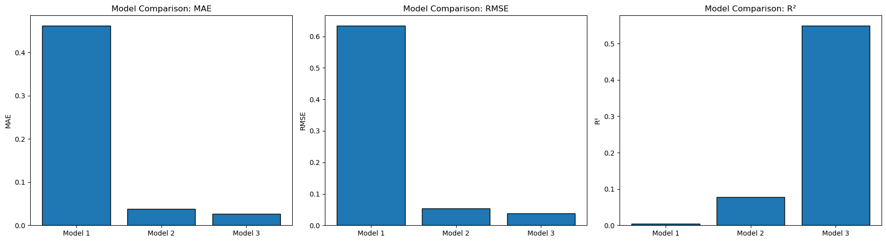

# Final Model

## New Features Added
- `calories_per_ingredient`
- `n_ratings`
- Aggregated review-model features: `rev_pred_mean`, `rev_pred_std`, `rev_pred_min`, `rev_pred_max`, `rev_count`
- Aggregated sentiment/text features: `sent_mean`, `sent_std`, `sent_pos_mean`, `sent_neg_mean`, `review_length_mean`

## Model Used
Our final model was a **CatBoostRegressor** predicting `smoothed_rating` rather than raw `avg_rating`. We used `smoothed_rating` because recipes with only a small number of ratings can have unstable averages, so smoothing makes the target more reliable by shrinking recipes with few ratings toward the overall mean.

The final model used **21 total features**, all of which were quantitative, with **0 ordinal** and **0 nominal** features. These included recipe and nutrition features (`minutes`, `n_steps`, `n_ingredients`, `calories`, `sugar`, `protein`, `carbohydrates`, `total_fat`, `sodium`), engineered features (`calories_per_ingredient`, `n_ratings`), aggregated review-model features (`rev_pred_mean`, `rev_pred_std`, `rev_pred_min`, `rev_pred_max`, `rev_count`), and aggregated sentiment/text features (`sent_mean`, `sent_std`, `sent_pos_mean`, `sent_neg_mean`, `review_length_mean`). Since the final feature set was entirely numeric, we did not need any categorical encoding, and missing values were handled with median imputation.

## Hyperparameters
### CatBoostRegressor
- `iterations`: 4000
- `learning_rate`: 0.03
- `depth`: 6
- `loss_function`: `"RMSE"`
- `random_seed`: 42
- `use_best_model`: `True`

### TF-IDF + Ridge intermediate text model
- `max_features`: 80000
- `ngram_range`: `(1, 2)`
- `min_df`: 2
- `alpha` (Ridge): 50.0

## Model Comparison Overview

We improved on the CatBoost in three steps (before choosing the final one):

- **Model 1 — CatBoost numeric → `avg_rating`**  
  This model used only numeric recipe-level features and predicted the raw average rating. Its inputs included structured variables such as preparation time, number of steps, number of ingredients, and nutrition information. It did not use review text or sentiment features.

- **Model 2 — CatBoost numeric → `smoothed_rating`**  
  This model used the same numeric recipe-level features as Model 1, but predicted `smoothed_rating` instead of raw `avg_rating`. The purpose of smoothing was to make the target more stable, especially for recipes with only a small number of ratings.

- **Model 3 — OOF TF-IDF(review) & Sentiment → Agg + CatBoost → `smoothed_rating`**  
  This was our final and most advanced model. It used the same numeric recipe-level features as the earlier models, but also added features extracted from review text. We first used a TF-IDF + Ridge model to generate out-of-fold predicted review ratings, then aggregated those predictions to the recipe level using summary statistics such as mean, standard deviation, minimum, maximum, and count. We also added aggregated sentiment and review-length features. These additional signals allowed the final model to use both structured recipe information and information from what reviewers wrote.

## Tuning Method
To bring in information from the text reviews, we used TF-IDF in an intermediate step rather than directly in the final CatBoost model. We first transformed review text into TF-IDF features using unigrams and bigrams, then trained a Ridge regression model to predict review ratings from the text. After that, we aggregated those predicted review scores to the recipe level, which gave us features such as the mean, standard deviation, minimum, and maximum predicted review score for each recipe. We also included aggregated sentiment and review-length features.
We selected the final CatBoost model by comparing it with the baseline and other candidate models on held-out validation performance. The final version was chosen using a validation set with `use_best_model=True`.

## Performance
- `MAE`: 0.0267
- `RMSE`: 0.0380
- `R^2`: 0.5496

## Improvement Over Baseline
The baseline Linear Regression performed near-chance (MAE = 0.4652, RMSE = 0.6410, R² = 0.00016), explaining essentially none of the variance in ratings. The final CatBoost model improved substantially across all metrics (MAE = 0.0267, RMSE = 0.0380, R² = 0.5496), with errors roughly 17× smaller and a meaningful share of variance explained.

We interpret this as a strong result given the nature of the task. The improvement suggests the model successfully leverages both structured recipe features and review-based signals. The remaining unexplained variance (R² ≈ 0.55) is expected — user ratings are inherently subjective and noisy, so a ceiling well below 1.0 is reasonable rather than a shortcoming of the model.

## Why These Features Make Sense
These features make sense for the prediction task because ratings are not only influenced by the recipe itself, but also by how people describe their experience with it. For example, more positive reviews, more consistent review scores, and stronger sentiment patterns should all relate to higher recipe ratings. Recipe-level features such as time, ingredients, and nutrition also matter because they reflect recipe complexity and the type of food being made.

